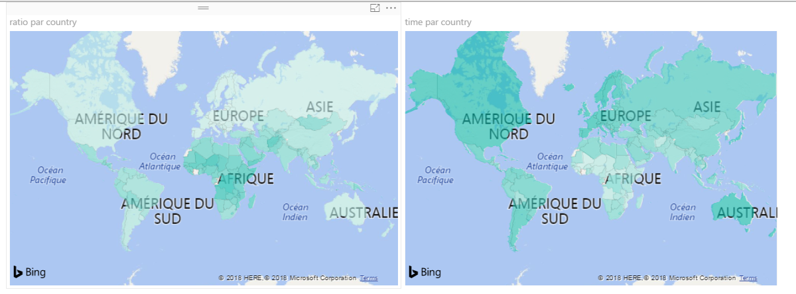
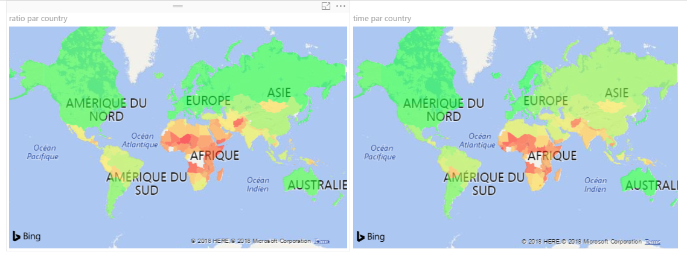
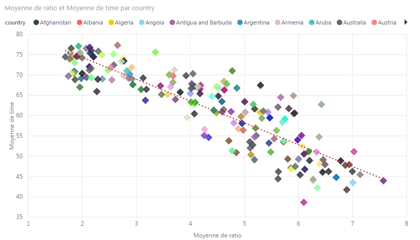

# Rapport final

## Introduction

J'ai décidé de faire une analyse sur le taux de naissance et la durrée de vie dans le monde pour voir si une relation entre ces deux phénomènes existe.

Ce sujet me semble intéressant car l'on peut constater selon la region du globe la différence de durée de vie et de taux de naissance qui semble etre lié.

## Données

Les données que j'ai récupéré viennent de la plateforme "UNdata" qui regroupe les données ouvertes des principales ONG. On peut y trouver une énorme quantité de données sur les populations dans le monde à travers les années.

## Résultats

Voici la carte du monde avec, respectivement, le taux de naissance et l'espérance de vie moyenne par pays 

On peut remarquer une certaine corrélation inverse entre les deux parametres selon les pays.

Avec un petit changement de couleur, on peut constater quelque chose d'intéressant. \
Apparements, les pays moins développés ont une durée de vie plus basse et un taux de natalité bien plus haut. L'Amérique du nord, l'Australie et l'Europe ont une vie plutot longue et a contrario, très peu d'enfants pas femme. Tandis que l'Afrique et le sud-ouest de l'Asie, qui sont en somme toujours en phase de développement, font beaucoup d'enfants mais ont une spérance de vie bien plus courte. En spéculant un peu, on peut immaginer que ce sont des pays où l'hygiene de vie est moins grande et l'accès aux médicament et hôpitaux est plus difficile.

On peut aussi trouver une certaine tendance entre ces deux paramètres a traves le monde.

## Conclusion

En conclusion, l'espérance de vie influence le taux de natatlité, c'est flagrant. Cependant ce n'est pas parce que l'on vit plus longtemps que l'on fais plus d'enfants mais l'incerse. J'immagine que cela est dû au fait que l'espérance de vie est une moyenne et qu'un Européen qui fait un enfant a peu de chance de mourrir avent de pouvoir procréer alors qu'un Africain a de fortes chance de mourrir jeune a cause de la faim ou de maladies.